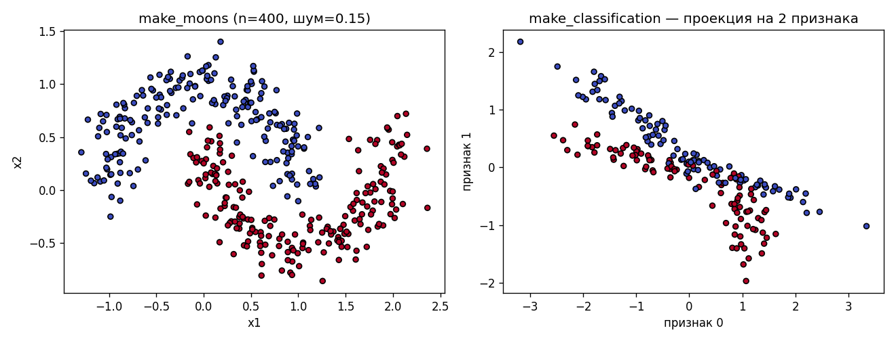
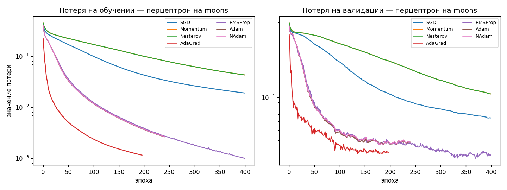
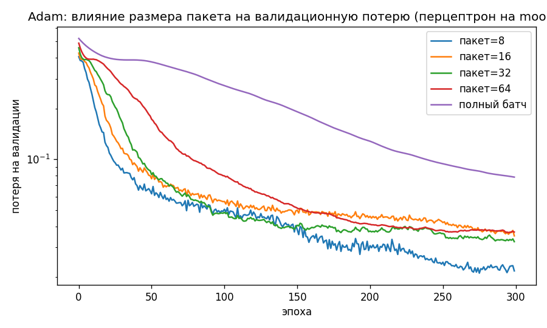
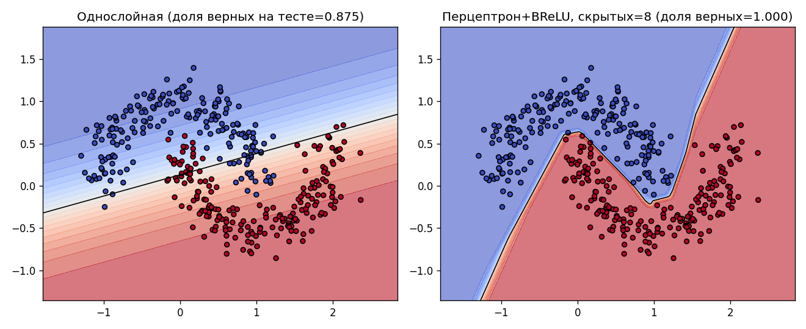
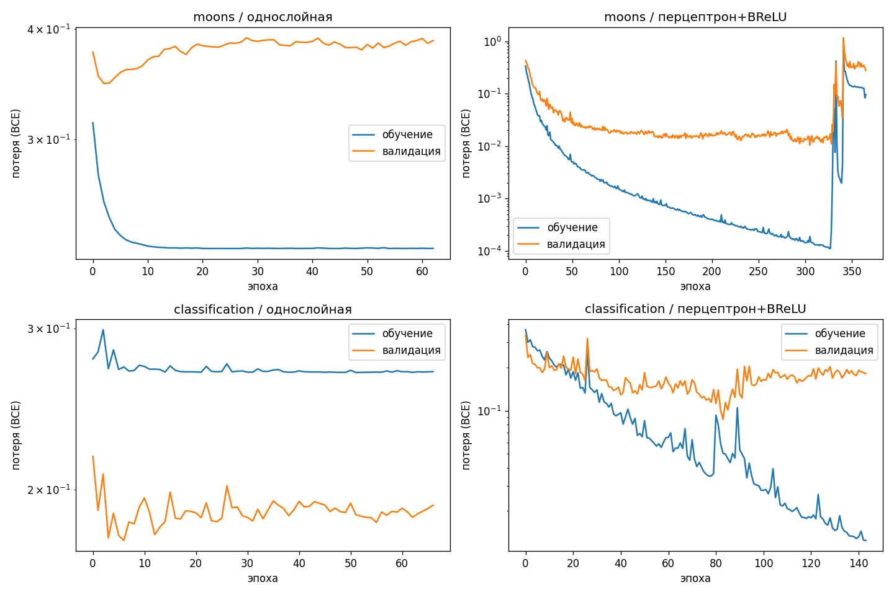

# Лабораторная работа №4 — отчёт

**Тема:** нейронная сеть для бинарной классификации, обучение методом стохастического градиентного спуска и его модификациями.

**Использованные библиотеки:** `numpy` (вся математика модели и оптимизация), `scikit-learn` (только для генерации данных и разбиения выборки), `matplotlib` (рисунки).

**Зерно случайных чисел (мой номер ИСУ):** `467715`.

Реализация кода находится в папке [`src/`](./src/), эксперименты — в [`research.ipynb`](./research.ipynb), рисунки — в папке [`figures/`](./figures/).

---

## 1. Что было сделано

### 1.1 Архитектуры моделей

| Модель | Формула | Где смотреть |
|---|---|---|
| **Однослойная сеть** (задание 1) | `y = σ(X W + b)` | [`src/model.py`](./src/model.py) |
| **Перцептрон с одним скрытым слоем** (задание 5) | `y = σ(BReLU(X W₁ + b₁) W₂ + b₂)` | [`src/model.py`](./src/model.py) |

Активации лежат в [`src/activations.py`](./src/activations.py):

- **Сигмоида** — реализована устойчиво: для `z ≥ 0` считаем как `1 / (1 + exp(-z))`, для `z < 0` — как `exp(z) / (1 + exp(z))`. Так не получаем переполнения при больших по модулю аргументах.
- **BReLU(B)** — ограниченный ReLU: `min(max(z, 0), B)`. Производная равна 1 строго внутри `(0, B)` и 0 на границах и снаружи. По умолчанию использую `B = 1`.

**Замечание про интерпретацию задания.** Формулировка «односвязная сеть, в основе которой будет BReLU + Sigmoid» допускает два прочтения. Я выбрал то, где у задания 1 нет скрытого слоя — это обычная логистическая регрессия с сигмоидой, а BReLU используется как активация скрытого слоя в задании 5. Буквальное прочтение «`σ(BReLU(z))`» даёт вырожденную модель: BReLU всегда неотрицателен, поэтому выход сигмоиды попадает в отрезок `[0.5, σ(B)]` — то есть сеть в принципе не может выдать вероятность класса 0 ниже половины. По этой причине я вынес BReLU туда, где он действительно даёт нелинейность.

### 1.2 Функция потерь

Бинарная перекрёстная энтропия (см. [`src/losses.py`](./src/losses.py)) с ограничением `p ∈ [10⁻¹², 1−10⁻¹²]` перед логарифмом, чтобы избежать `NaN`. Производная по выходу сигмоиды свёртывается в простое выражение `dL/dz = (ŷ − y) / n`, и именно она используется при обратном проходе в моделях.

### 1.3 Оптимизатор

В файле [`src/optimizer.py`](./src/optimizer.py) реализован один класс `SGD` с тремя независимыми переключателями:

- `batch_size` — произвольный размер мини-выборки; `0` или больше размера обучающей выборки означает полнобатчевый режим;
- `momentum ∈ {none, classic, nesterov}` — без момента, классический момент Поляка либо Нестеров (в форме Сутскевера, чтобы не вычислять градиент в точке-«заглядывании»);
- `adaptive ∈ {none, adagrad, rmsprop}` — поэлементное масштабирование шага.

Так из одного класса собираются все семь «именованных» методов:

| Название | `momentum` | `adaptive` |
|---|---|---|
| Чистый SGD | none | none |
| Momentum (Поляка) | classic | none |
| Nesterov | nesterov | none |
| AdaGrad | none | adagrad |
| RMSProp | none | rmsprop |
| **Adam** | classic | rmsprop |
| NAdam-подобный | nesterov | rmsprop |

> **Важное уточнение про мой Adam.** В задании сказано реализовать «модификацию Adam — связку Momentum/Nesterov + AdaGrad/RMSProp». Каноническая формула Adam такова: сначала считают экспоненциальное сглаживание самого градиента `m_t` и его квадрата `v_t`, затем шаг равен `lr · m̂_t / (√v̂_t + ε)`. В моей реализации порядок другой: сначала делается шаг RMSProp (градиент делится на корень из сглаженного квадрата), а уже к получившемуся «нормированному» градиенту применяется момент. То есть это **именно связка** Momentum + RMSProp, как просит задание, но это не равносильно классической формуле Adam из статьи Кингмы и Ба. На наших данных эта модификация ведёт себя как обычный Adam и стабильно входит в число лучших методов, но строго говорить «PyTorch-овский Adam» здесь нельзя.

В обе формулы заложена поправка на смещение по `β₁, β₂` (как в исходной Adam-статье).

### 1.4 Процесс обучения

В методе `Model.fit(...)` происходит следующее:

- разбиение 60/20/20 со стратификацией по классам (двумя вызовами `train_test_split`);
- нормировка признаков по среднему и стандартному отклонению, посчитанным **только** по обучающей части;
- цикл по эпохам с перемешиванием индексов на каждой эпохе (`np.random.default_rng(seed)`) и проходом по мини-выборкам;
- запись потерь и доли верных ответов на обучении и валидации на каждой эпохе;
- ранняя остановка по валидационной потере: если она не уменьшается в течение заданного запаса эпох (параметр «терпения»), обучение прерывается, и модель откатывается к лучшим весам.

### 1.5 Подбор гиперпараметров

Для каждой пары (датасет × модель) перебирались:

- все семь пресетов оптимизатора;
- сетка по шагу обучения, своя для каждого семейства (адаптивные методы любят шаг поменьше);
- размер мини-выборки `∈ {16, 32, 64}`;
- для перцептрона дополнительно размер скрытого слоя `∈ {8, 16, 32}`.

Лучшая конфигурация выбирается по **минимуму валидационной потери**, а не по доле верных ответов: я хочу получить устойчивые вероятности, а не «удачное» округление к классу.

---

## 2. Датасеты

```python
X1, y1 = make_moons(n_samples=400, noise=0.15, random_state=467715)
X2, y2 = make_classification(n_samples=200, n_features=5, n_redundant=2,
                             random_state=467715, n_informative=2,
                             n_clusters_per_class=2, n_classes=2)
```

| Датасет | n | признаков | классы | особенность |
|---|---|---|---|---|
| `moons` | 400 | 2 | 200 / 200 | граница нелинейная |
| `classification` | 200 | 5 | 100 / 100 | 2 информативных + 2 избыточных + 1 шумовой, по 2 кластера на класс |



---

## 3. Результаты

### 3.1 Метрики на тестовой выборке

| Датасет | Модель | Оптимизатор | шаг | размер пакета | размер скрытого слоя | доля верных | точность | полнота | F₁ |
|---|---|---|---|---|---|---|---|---|---|
| moons | однослойная | RMSProp | 0.05 | 32 | — | **0.875** | 0.841 | 0.925 | 0.881 |
| moons | перцептрон + BReLU | RMSProp | 0.05 | 16 | 8 | **1.000** | 1.000 | 1.000 | 1.000 |
| classification | однослойная | AdaGrad | 1.00 | 16 | — | **0.950** | 0.909 | 1.000 | 0.952 |
| classification | перцептрон + BReLU | RMSProp | 0.05 | 16 | 16 | **0.900** | 0.864 | 0.950 | 0.905 |

Тот же набор в виде CSV — [`figures/summary.csv`](./figures/summary.csv).

### 3.2 Сравнение оптимизаторов (перцептрон на `moons`)



- **Adam, RMSProp и NAdam-подобный** ведут себя почти одинаково: уже после первых десятков эпох опускают потерю на порядок и стабильно опускаются к минимуму.
- **AdaGrad** на этих данных вышел в плато быстрее всех и остановился ранней остановкой раньше остальных; накопленный квадрат градиентов начинает сильно гасить шаг к концу.
- **Momentum и Nesterov** без адаптивности при тех же шагах обучения заметно медленнее. Их кривые практически совпадают — на наших данных классический и нестеровский варианты почти неразличимы.
- **Чистый SGD** работает, но медленнее и упирается в плато выше остальных.

### 3.3 Влияние размера мини-выборки (Adam, перцептрон на `moons`)



- При размере пакета 8 видны заметные шумовые колебания валидационной потери;
- 16–32 — самое разумное: быстрая сходимость и спокойная кривая;
- 64 и полный батч — кривая гладкая, но к минимуму подходит медленнее. На нашей обучающей выборке всего 240 точек, и при полном батче стохастичности почти не остаётся.

### 3.4 Разделяющая поверхность на `moons`



Слева — линейная разделяющая поверхность однослойной сети: она пересекает оба полумесяца, поэтому часть точек на концах попадает не в тот класс. Справа — перцептрон с BReLU и восемью нейронами скрытого слоя: граница повторяет форму полумесяцев, на тестовой выборке достигнут 100% результат.

### 3.5 Кривые обучения для финальных моделей



На `moons` перцептрон стабильно опускает обучающую потерю до порядка 10⁻⁴, валидационная при этом плавно выходит на плато. На `classification` обучающая потеря у перцептрона спускается дальше, чем валидационная, — это типичный признак переобучения. Ранняя остановка вовремя выключает обучение и возвращает лучшие веса.

---

## 4. Выводы

1. **Перцептрон со скрытым слоем нужен там, где граница между классами нелинейная.** На `moons` это видно лучше всего: однослойная модель упирается в потолок около 0.83–0.88 валидационной доли верных ответов, а перцептрон с восемью скрытыми нейронами и BReLU(1) выходит на 1.0. Это та самая качественная разница, ради которой добавляется скрытый слой.

2. **На датасете `classification` однослойная модель оказалась не хуже.** Конкретно у меня она даже чуть лучше перцептрона на тестовой выборке (0.95 против 0.90). Причины такие:
   - обучающих примеров мало (`n_train = 120` при пяти признаках), и перцептрон с шестнадцатью скрытыми нейронами имеет порядка ста параметров — больше, чем строк в данных;
   - три признака из пяти (два избыточных плюс один не самый информативный) представляют собой линейные комбинации информативных, и логистическая регрессия их «не замечает», а перцептрон может на них переобучиться;
   - тестовая выборка состоит из 40 точек, каждая ошибка стоит 2.5% доли верных ответов; разница «0.95 против 0.90» — это всего две лишние ошибки, что в пределах статистической погрешности.

   Отсюда практический вывод: на маленьких низкоразмерных задачах с почти линейной структурой простая модель устойчивее. Хорошо иметь линейную модель рядом с перцептроном как точку сравнения.

3. **Adam и RMSProp выигрывают у чистого SGD за счёт адаптивности шага.** Главное их преимущество — устойчивость к выбору длины шага: одинаково работают на широком диапазоне шагов от 0.005 до 0.05. Чистый SGD требует более аккуратной настройки.

4. **Момент сам по себе, без адаптивности, особого выигрыша не дал.** На наших данных вклад второго момента (то есть RMSProp-части) важнее, чем накопление инерции в направлении градиента.

5. **Ранняя остановка реально полезна.** На `classification` перцептрон без неё после 150–200 эпох начинает переобучаться. С запасом терпения в 60 эпох обучение прерывается, как только валидационная потеря перестаёт улучшаться, и модель откатывается к лучшим весам.

---

## 5. Воспроизводимость

- Все источники случайности зафиксированы: `seed_everything(467715)` плюс отдельный генератор `np.random.default_rng(seed)` внутри метода `fit`.
- Зависимости перечислены в [`requirements.txt`](./requirements.txt).
- Ноутбук [`research.ipynb`](./research.ipynb) собирается и прогоняется одной командой:

  ```bash
  python build_notebook.py
  ```

  Скрипт пересобирает все ячейки, заново выполняет эксперименты и сохраняет рисунки в папку `figures/`.

- Быстрая проверка моделей лежит прямо в [`src/model.py`](./src/model.py) в блоке `__main__` — её можно запустить, не открывая ноутбук:

  ```bash
  cd src && python model.py
  ```
